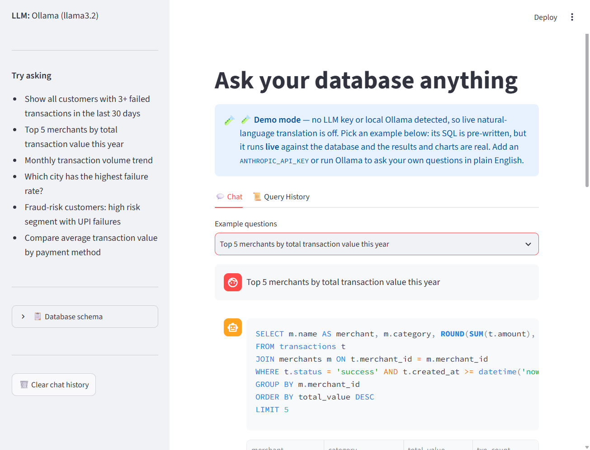

# QueryPilot

**Ask a database questions in plain English — and it is structurally impossible for the answer to write to, alter, or escape that database.**

[](https://github.com/siddharthgaur1/querypilot/actions/workflows/ci.yml) [](https://www.python.org/downloads/) [](LICENSE) [](#run-with-zero-api-keys)

> **Live demo:** _pending deploy to Hugging Face Spaces (free CPU)._ The demo is
> **fully clickable with no API key**: pick an example question and watch its SQL
> run live against the database. The screenshot below is that demo mode running
> locally — real query, real results, unedited.



## Problem → Approach → Result

**Problem.** Ad-hoc questions against a database mean writing SQL or waiting on
whoever can. Handing an LLM a live connection solves the waiting and creates a
worse problem: a model that can be prompted — or can simply be wrong — into
`DROP TABLE`.

**Approach.** Convert English → SQL, but never trust the SQL. Every query runs on
a connection that is read-only at the SQLite engine level (`PRAGMA query_only`)
*and* behind a SQLite **authorizer** that denies any non-read operation at prepare
time, before a row is touched — so the safety does not depend on parsing the SQL
text, which is the part an attacker controls.

**Result.** A natural-language database interface where the destructive failure
mode is closed by construction, verified by tests that feed raw `DROP`/`UPDATE`/
`ATTACH` straight past the text validator and assert the engine refuses them.

---

## Run with zero API keys

Two ways to run, both free:

**Demo mode (no key, no Ollama — fully clickable):**

```bash
git clone https://github.com/siddharthgaur1/querypilot
cd querypilot
pip install -r requirements.txt
streamlit run src/app.py            # builds the demo DB on first boot
```

With no LLM backend detected, the app serves committed **example questions** whose
SQL is pre-written but **executes live** — real results, real charts. Only the
English→SQL translation is pre-authored, and the UI says so.

**Full natural-language mode (free, local):** install [Ollama](https://ollama.com),
then `ollama pull llama3.2`. QueryPilot auto-detects the local daemon and you can
type your own questions — no key, no cloud, no spend.

**Bring your own key (optional):** set `ANTHROPIC_API_KEY` for higher-quality
translation. Paid; everything above is free.

| Variable | Required | Default | How to get it free |
| --- | --- | --- | --- |
| `ANTHROPIC_API_KEY` | No | _(empty)_ | Paid. Skip it — use Ollama (free/local) or demo mode. |
| `QUERYPILOT_DEMO` | No | _(unset)_ | Set to `1` to force demo mode (used by the hosted deploy). |
| `QUERYPILOT_ALLOWED_TABLES` | No | _(all tables)_ | Comma-separated table allow-list, enforced by the SQLite authorizer. |

## Architecture

```
User question
      │
      ▼
Schema introspection  ←── reads live DDL + sample rows from SQLite
      │
      ▼
LLM (Claude / Llama3.2)  →  raw SQL
      │
      ▼
validate_sql() ──── fail ──→ LLM self-correction (1 retry, then give up)
      │ pass
      ▼
_execute()  [PRAGMA query_only=ON + SQLite authorizer (deny non-reads),
             optional table allow-list, row cap, real wall-clock timeout]
      │
      ▼
Results + AI summary + auto-chart
```

## Tech stack

| Choice | Why |
|---|---|
| SQLite + `PRAGMA query_only=ON` | Every connection is read-only at the engine level — even a validator bypass can't produce a write, because SQLite itself refuses. |
| Regex + engine read-only + SQLite authorizer + table allow-list (4 layers) | A regex blocklist alone is guessable; the authorizer runs inside SQLite on the compiled statement and denies non-reads at prepare time, so a text-level bypass still fails safe. |
| Claude, with Ollama fallback | Claude for SQL generation quality; Ollama lets it run fully offline/free for local dev without an API key. |
| SQLite over Postgres/MySQL for the demo DB | Zero setup for a portfolio project — the whole point is the NL→SQL→safety pipeline, not database administration. |
| Streamlit | Chat UI, schema browser, and chart/export in one file, no separate frontend. |

## Setup

```bash
pip install -r requirements.txt
export ANTHROPIC_API_KEY=sk-ant-...   # or install Ollama for a free local backend
python scripts/setup_db.py --rows 10000
```

## Running it

```bash
streamlit run src/app.py
pytest tests/ -v
```

## The safety layers

Four independent layers guard the database. Full write-up in
[SECURITY.md](SECURITY.md).

1. **Statement-shape check** (`validate_sql`) — single statement only, must start
   `SELECT`/`WITH`, plus a forbidden-keyword regex. This is *early, friendly
   rejection* — string matching on SQL is guessable, so it is not the boundary.
2. **Engine-level read-only** — `PRAGMA query_only = ON` on every connection;
   SQLite itself refuses any write.
3. **SQLite authorizer** — a per-access callback that allows only
   `SELECT`/`READ`/`FUNCTION`/`RECURSIVE` and **denies every other operation
   (INSERT/UPDATE/DELETE/DDL/ATTACH/PRAGMA) at prepare time**. This runs *inside*
   SQLite on the compiled statement, so it cannot be fooled by clever SQL text —
   it is the real boundary.
4. **Optional table allow-list** — `QUERYPILOT_ALLOWED_TABLES` scopes reads to
   named tables, enforced by the same authorizer.

Plus a real wall-clock **timeout** (`set_progress_handler`, not the busy-lock
timeout) and a **row cap** (`fetchmany`).

`tests/test_agent.py::TestReadOnlyEnforcement` is the important one: it feeds
`DROP`, `UPDATE`, `INSERT`, `PRAGMA writable_schema`, and `ATTACH` **directly to
the connection, bypassing `validate_sql` entirely**, and asserts the engine denies
every one — proving the guarantee does not rest on the guessable text layer. The
table allow-list and the runaway-CTE timeout are tested the same way.

## Bugs found and fixed during polish

- **The query timeout didn't do anything.** `sqlite3.connect(db_path,
  timeout=15)` sets sqlite3's *busy* timeout — how long to wait for a lock on
  a contended database — not a cap on how long a query itself may run. A
  pathological query (a recursive CTE, a big cross join) could run
  indefinitely despite the README claiming a 15-second timeout. Fixed with
  `conn.set_progress_handler()`, which SQLite calls periodically during
  execution and can use to interrupt a long-running query. Verified against
  an actual runaway recursive CTE, not just a timing assumption.
- **The Streamlit UI crashed on the first query.** `_render_chart()` and
  `_render_export()` were called before they were defined in the script —
  Python executes top-to-bottom, and Streamlit re-runs the whole script on
  every interaction, so this was a guaranteed `NameError` on the very first
  result. Moved the definitions above their call sites.

## What I'd improve with more time

1. **No prompt-injection testing.** The blocklist defends against the LLM
   generating a write; it doesn't defend against a user crafting a *question*
   designed to make the LLM emit a query that leaks data it shouldn't (e.g.
   phrasing that gets around a `WHERE` clause a real analyst would add). The
   engine-level read-only guarantee limits the damage to *read* leakage, but
   that's still worth testing explicitly.
2. **`EXPLAIN QUERY PLAN` isn't used to pre-empt slow queries** — it's only
   shown after the fact as an optional UI toggle. Running it before execution
   and rejecting queries with an obviously catastrophic plan (e.g. no index
   usage on a large table) would catch expensive queries before spending the
   full timeout budget on them.
3. **Self-correction retries only once** and doesn't distinguish "SQL syntax
   error" (worth retrying) from "the question is unanswerable with this
   schema" (retrying just burns another LLM call for the same failure).

## Related projects

- [llm-regression-detector](https://github.com/siddharthgaur1/llm-regression-detector) — same eval-gate pattern that would apply to NL→SQL accuracy regressions here.
- [finrag](https://github.com/siddharthgaur1/finrag) — hybrid RAG over financial PDFs.
- [rag-hybrid-search](https://github.com/siddharthgaur1/rag-hybrid-search) — hybrid dense+BM25 RAG pipeline.
- [ipo-gmp](https://github.com/siddharthgaur1/ipo-gmp) — XGBoost IPO listing-return predictor.
